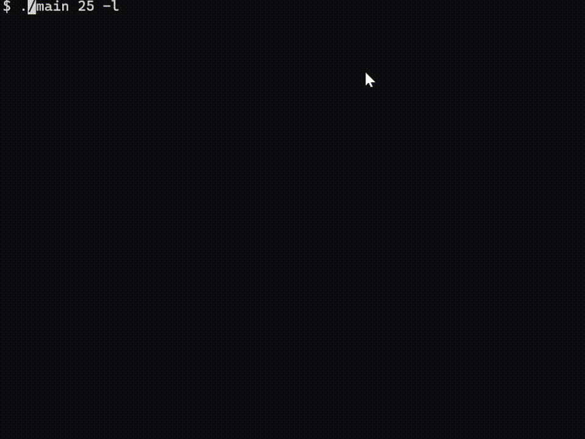

# 雷のシミュレーション

これだけを観て, 再現を試みました

https://www.youtube.com/watch?v=3mVXibo4MN0
[](https://www.youtube.com/watch?v=3mVXibo4MN0)



```
$ gcc main.cpp -o main -Wall
$ ./main [<size>] [-s <seed>] [-e <eta>] [-l] [-d]
```

- `-l` は live mood. デフォルトだと, 1 ステップごとにキー入力待ちになる.
- `-d` は debug mood. Debug mood では, 選択確率もプリントされる.

## 参考動画の説明と異なるところ

- 次に色を塗る候補が 15 個以上になったら, 確率が最小のセルを候補から外す.
- あるセルを避雷針に設定する. セル $C_{ij}$ と避雷針との距離を $d_{ij}$, 距離の最大値を $d_{\max}$ としたとき, 
    以下の $p'_{ij}$ を定め, 参考動画で紹介されている確率と平均をとる.
    避雷針は赤い四角としてプリントする.
```math
p'_{ij} := 1 - \frac{d_{ij}}{d_{\max}}
```
